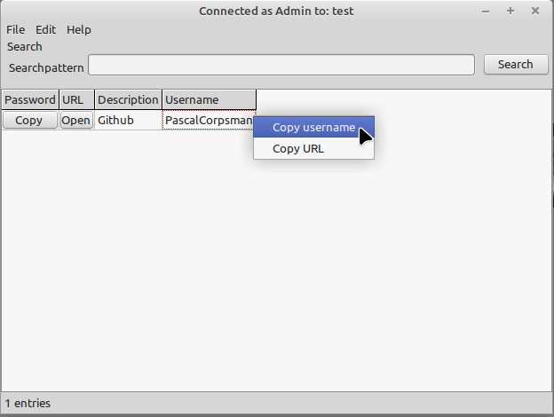
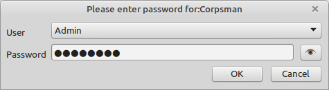
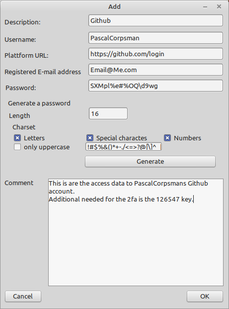
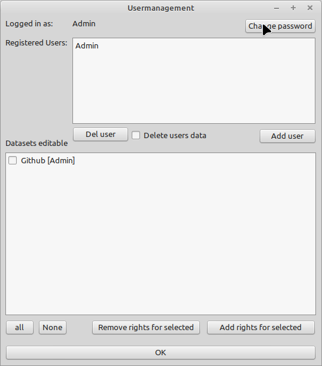

# PWM

This is PassWord Manager (PWM) written in Free Pascal. It uses a Rijndael (4096-Bit Key) to store its data in its database. Do not leave the programm open for long times its security is only existing when closed.

Features:
- multi user
- easy to use
- password generation
- link storage
- Windows / Linux supported

#### Login screen

#### Add new password

#### User managament

## License
  See the file license.md, located under: 
  https://github.com/PascalCorpsman/Software_Licenses/blob/main/license.md 
  for details about the license.

Warranty: There is no warranty use on your own risk!

## What needs to be done to compile the code ?

1. Install Lazarus IDE from https://www.lazarus-ide.org/
2. Install the following packages into the Lazarus IDE (from online package manager):   
    - Unique Instance
    - dcpcrypt

